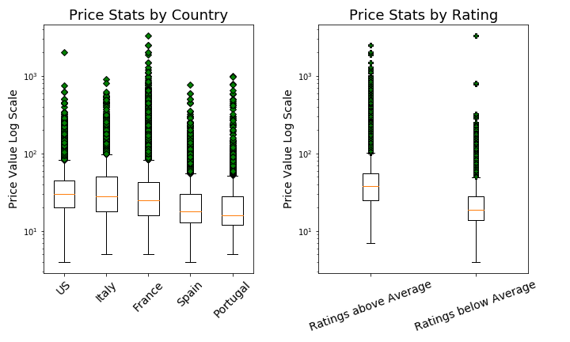
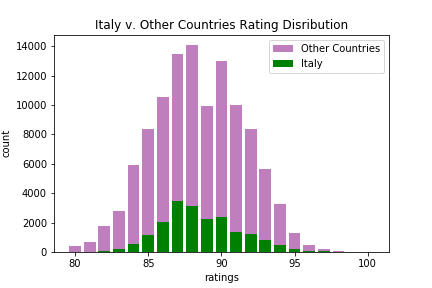
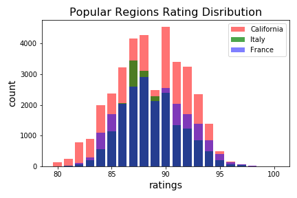
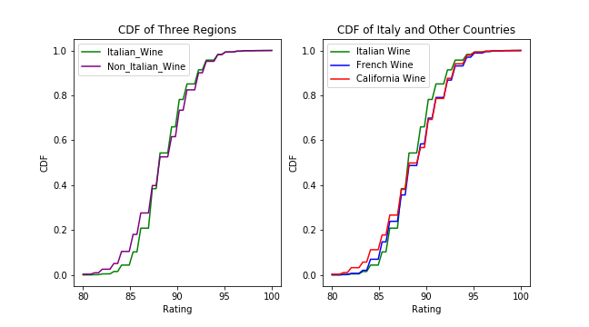
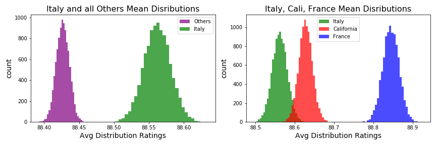

# wine_ratings 

## Motivation
As a self-proclaimed Oenophile, analyzing the data collected by wine experts from [WineEnthusiast](https://www.winemag.com/), allows me to dive into the subjective subject of wine ratings. Ratings can help guide consumers to spend their money on wine that has verified and quantified quality without needed to test it themselves. This key advertising strategy has launched a series of tasting events, social media rating apps, along with wine competitions. Wine consumption continues to increase drastically, and as such, exploring the use of the rating system is a key aspect to moving forward in the wine industry. 

## About this Data
* The initial visual of this data provids a total of thirteen columns. Of these thirteen, the following 5 columns anticipate the most interet with my Data Analysis. 
    1. country: This gives the full name of the Country where the wine was made.
    2. description: Here is the description given by the wine taster
    3. points: This refers to the rating given by the taster
    4. price: Price of wine at the moment it was tasted
    5. province: states, divisons or other special areas within a country where winery is located6

* With 43 different countries available, the 10 most frequent and 10 least frequent help gain perspective of the true variation in available data per country. US, Italy and France have the most available data per country, while China, Slovakia and Egypt have only one sample. 

* Price seems to drive much of the wine business. Viewing the inital disribution of prices, most wines tasted were between $4 and $80. However, these tasters have also ventured into the outlandish prices including the most exensive bottle at $330,000. 

    * In the visual above, the prices with the top five countrys all have substatial outliers, the most variation being in France. 
    * Noting the downward trend on teh right graph shows an overall price drop when compared to the rating below and above the average rate value for the entire database. 

Please follow the link provided here: <a href = "https://github.com/hberginc/wine_ratings/blob/master/src/cleaning_justification.md">cleaning justifications</a>, for more information reguarding my data exploration and cleaning process. 

## Hypotheses

1.  ### Italian Wine Compared to Other Countries
Null Hypothesis: Italian wines have the same ratings as the remaining data. 

Alternative Hypothesis: Italian wines have higher ratings when compared to other countries. 

##### An initial view: 

 *The collection of ratings range from 80 to 100; this is a typical 20 point rating system the many countries employ. Here we see very little differene in the two distributions visually.*

 * Performing further investigation like the Mann Whitney U test helps determine if these two distributions would have come from the same population.  
 * Setting a significance level of 0.05 and returning a p_value of 0.0008 determines that I am confident that the there is enough evidence to state that **Italian wines on average rate higher than the other countries wines.**

2. ### Three Way Comparison between Italy, France and California. 
Similarly, I was interested in going further with this investigation and compare Italian wines to three other popular regions. 

I was now interested in determining if:

    a. Italian wines have higher ratings when compared to France.

    b. Italian wines have higher ratings when compared to California.

    c. French Wines have higher ratings when compared to California. 

* Each of these hypotheses merit the use of the Mann Whitney U test all single tailed since I am looking for a clear 'best' characteristic of the regions ratings.

*A quick preview of the rating distributions shows very little difference in their overall popularity.* 

 * First and Second comparison showed no significant difference in the ratings between the Italian wines and the French wines. Due to the utilization of the Italy data in my previous hypothesis, I utilized the Bonferroni Correction to modify the inital p_values for each sample that was repeated. Gathering a p_value of 1 for both tests comparing Italy, showing no confidence in a difference between the two. 
 * Surprisingly, there was a statistical difference with French and Californian wines. **French wines do have a greater average rating than Californian wines**, gathering a p_value of 1.429e-07. 

Before stocking up on Chablis, the image below shows the cumulitive distribution functions for the regions in question. The minimal differences in the slopes of each region does not highlight the previous statistical findings noted above. Investigating the slight variation in slope would note minor differences in our wine's point values. 

*Examining the slopes of these graphs compared to each region, we see very little change when determing the difference in points. Idenifying the incremental increase in the French wines, the slopes are steeper around 93 points than Italy, indicating more French wines accumulated that point value.* 

To truly investigate the weight of the statistical test, I bootstrapped means of each region of interest. The image below highlights those findings. 
    

Region  | Avg. Rating   | Available Samples
------- | ------------- | ------------------
Italy | 88.56 | 19,540
France | 88.85 | 22,093
California | 88.63 | 36,247 

*Taking a closer look at a bootstrapped mean distribution helps highlight the variances that our statistical tests caught onto. Note the x_axis is a range  of at most a half of a point value.*

### **Although there is an obvious statistical difference in these wine ratings, note that the practical difference is too minimal to encourage interested parties to stock up on specific region based wines.**

## Extended Testing

### Price and Rating comparison for expensive wines

Life is too short to drink bad wine, but does that mean it's worth diggin deap into your pockets for a bottle that is more than $150? 

The correlation between price and rating may be expected but is it really that much stronger than the cheaper bottles? Looking initially at the following scatterplots, the volume of data is certainly disproportionate, given that only 1% of the wines fall above $150; however both correlations between price and point value visually have an upward trend. 

* ##### It is important to note that any wines that do not meet the point systems minimum value of 80 would not be included in this graph and could influence future results. 

Utilizing the spearman correlation test, the cheaper wines have almost double the correlation value between rating and the price point. 

Price Category  | p_value |  Correlation Coefficient
--------------- | --------- | -------------------------
Cheaper | 0 | 0.6
Expensive | 1.67e-30 | 0.32 

### Of wines that are sufficient to meet the minimum 80 point requirment, **there is a higher correlation beteen price and rating when the price was below $150.** When purchasing an expensive wine, looking at increased prices past this threashold may not provide the expected increase in point value as well.

## Future Directions

Due to exploring this database, I have interest in including a time component to determine possible increase in ratings on specific areas that are trending. California, for example, has really helped put the US on the map when discussing great wines. Merging this database with more ratings from different blind tastings and including a time component would possibly allow me to find vinyards that are soon to be popular. 

## Resources
[Wine Reviews Kaggle Database](https://www.kaggle.com/zynicide/wine-reviews)

[WineEnthusiast E-Magazine](https://www.winemag.com/)

[Hisory of Wine Ratings Wikipedia](https://en.wikipedia.org/wiki/Wine_rating#History)